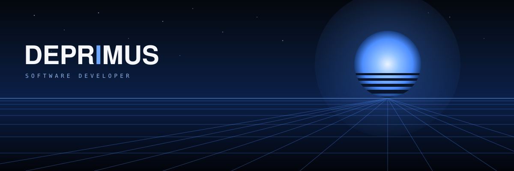
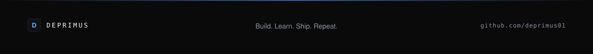

[](https://deprimus.vercel.app/)
[](https://github.com/deprimus01)
[](https://linkedin.com/in/deprimus01)
[](mailto:deprimus01@gmail.com)

<br>

| BUILDING | FOCUS | LEARNING | CREATIVE |
|---|---|---|---|
| Full-stack web applications | React • Node.js • PostgreSQL | Architecture • APIs • Auth | Video editing • Visual design |

---

## // About

I'm a software developer working on full-stack web applications, currently deepening my understanding of backend architecture, APIs, and databases. I enjoy turning ideas into working projects and improving one skill at a time. Outside of code, I also work on video editing and visual design.

```js
const deprimus = {
  role: "Software Developer",
  building: ["Web Applications", "Full-Stack Systems"],
  stack: ["React", "Node.js", "PostgreSQL"],
  exploring: ["Architecture", "APIs", "Authentication"],
  creative: "Video editing & visual design",
  mindset: "Build. Learn. Improve.",
};
```

---

## // Tech Stack

**Frontend**


**Backend**


**Database**


**Tools**


---

## // Featured Projects

**ScholarLog**
Student productivity platform for managing notes, assignments, planning, revision, GPA tracking, reflections, and study progress.
`React` `Node.js` `PostgreSQL`
[Live →](https://scholarlog.online)

**Deprimus Tech Store**
Inventory and sales management system built for a small electronics and accessories business.
`Node.js` `PostgreSQL`

**Primus Schools**
School website and application system built during my SIWES project.
`HTML` `CSS` `JavaScript` `Express` `SQLite`

**Deprimus Portfolio**
Personal developer portfolio and creative space.
`React` `Vite`
[Live →](https://deprimus.vercel.app/)

---

## // Currently

| | |
|---|---|
| **Building** | Full-stack applications |
| **Learning** | Backend architecture |
| **Exploring** | APIs • Authentication • PostgreSQL |
| **Improving** | React • System design |

---

## // Activity


<br>


